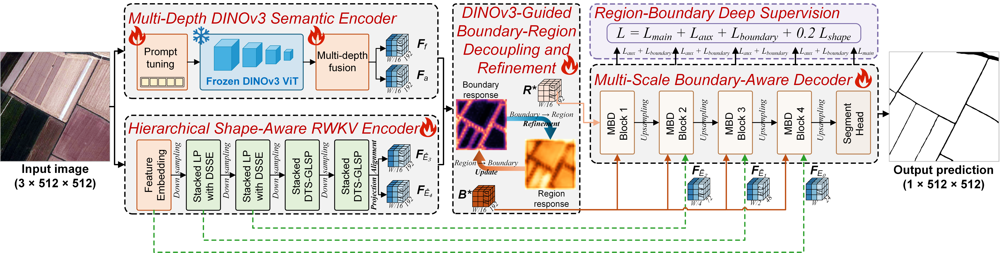

# DBANet

Official model implementation for **DBANet: A Dual-Encoder Boundary-Aware Network with DINOv3-Guided Boundary-Region Decoupling for Generalizable Agricultural Parcel Delineation**.

DBANet combines transferable semantic representations from a frozen satellite-pretrained DINOv3 with hierarchical task-specific representations of parcel geometry and boundaries. Boundary–region decoupling and multi-scale boundary-aware decoding are used to recover complete parcel regions and continuous boundaries across diverse agricultural landscapes.



## Architecture

DBANet contains four main components:

- **Multi-Depth DINOv3 Semantic Encoder (MDSE)** extracts Blocks 4, 11, 17, and 23 from DINOv3 ViT-L/16 SAT-493M. Block 23 provides the semantic anchor, while earlier features are incorporated through a zero-initialized gated residual.
- **Hierarchical Shape-Aware RWKV Encoder (HSRE)** provides multi-resolution parcel geometry and boundary features using shallow shape-aware branches and deep deformable token-shift WKV spatial mixing.
- **DINOv3-Guided Boundary-Region Decoupling and Refinement (BRDR)** uses foundation–task representation disagreement as a soft prior, separates low- and high-frequency components with a learnable radial soft mask, and sequentially refines boundary and region representations.
- **Multi-Scale Boundary-Aware Decoder (MBD)** progressively restores spatial resolution using dynamic upsampling, the BRDR boundary feature, HSRE skip features, and multi-scale strip context.

During training, Region-Boundary Deep Supervision constrains four intermediate region predictions, four boundary predictions, and two shallow shape predictions. Evaluation mode returns only the final parcel logits by default.

## Repository Contents

```text
DBANET/
├── DBANet.py
├── ikan.py
├── rwkv_unet.py
├── cuda/
│   ├── wkv_cuda.cu
│   └── wkv_op.cpp
├── overall.png
└── README.md
```

`DBANet.py` is the executable model entry. The local KAN and RWKV files remove dependencies on other source directories in the original research workspace.

## Requirements

- Python 3.10 or later
- PyTorch with CUDA support for full-resolution inference
- `timm`
- A CUDA toolkit and a compatible C++ compiler when the WKV extension is not already cached

Install the Python dependencies using the PyTorch build appropriate for the local CUDA environment, followed by:

```bash
pip install timm
```

The satellite-pretrained DINOv3 and RWKV-UNet-B weights are downloaded automatically when `pretrained=True`. Internet access or an existing local cache is therefore required for pretrained initialization.

## Quick Check

Run a reduced-resolution CUDA forward pass without downloading pretrained weights:

```bash
python DBANet.py --image-size 64 --device cuda
```

Inspect all training-time outputs:

```bash
python DBANet.py --image-size 64 --device cuda --aux
```

The published configuration uses 512 × 512 inputs:

```bash
python DBANet.py --image-size 512 --device cuda --pretrained
```

A small PyTorch WKV fallback permits reduced-resolution CPU checks. Full-resolution execution requires the CUDA WKV extension.

## Python Usage

```python
import torch
from DBANet import DBANet

model = DBANet(
    num_classes=1,
    img_size=512,
    pretrained=True,
).cuda().eval()

image = torch.randn(1, 3, 512, 512, device="cuda")
with torch.inference_mode():
    logits = model(image)

probability = logits.sigmoid()
mask = probability > 0.5
```

The input height and width must equal the configured square `img_size` and be divisible by 16. Binary parcel delineation uses `num_classes=1`.

## Checkpoint Loading

The executable accepts checkpoints stored directly as a state dictionary or under `model_state_dict`, `state_dict`, `model`, or `net`:

```bash
python DBANet.py \
  --image-size 512 \
  --device cuda \
  --checkpoint /path/to/best_model_checkpoint.pth
```

Programmatic strict loading is also supported:

```python
import torch
from DBANet import DBANet, _checkpoint_state

model = DBANet(img_size=512, pretrained=False)
checkpoint = torch.load(
    "/path/to/best_model_checkpoint.pth",
    map_location="cpu",
    weights_only=False,
)
model.load_state_dict(_checkpoint_state(checkpoint), strict=True)
```

## Output Interface

In evaluation mode, `model(image)` returns final logits with shape `[B, num_classes, H, W]`.

Using `return_aux=True`, or calling the model in training mode without overriding `return_aux`, returns:

| Key | Content |
|---|---|
| `seg` | Final parcel logits |
| `seg_deep` | Four decoder-stage region predictions |
| `boundary` | Four decoder-stage boundary predictions |
| `snake_curve` | Two shallow shape predictions |
| `disagreement` | Foundation–task representation disagreement |

## Reported Results

Experiments reported in the manuscript use very-high-resolution imagery and the final experimental records in the project documentation.

| Evaluation setting | Reported result |
|---|---:|
| Mean within-dataset IoU on AI4Orthos, FGFD, and CCPTD | 84.54% |
| Mean cross-dataset IoU | 62.15% |
| Mean cross-area IoU | 61.23% |
| Mean area-adjusted overall accuracy over 25,354 km² | 88.92% |

Cross-dataset, cross-area, and large-scale mapping evaluations use direct inference without target-domain fine-tuning.

## Model Scale

The released architecture contains 332.31 M parameters, of which 29.23 M are trainable under the default frozen-DINOv3 configuration.

## Code

Project repository: [https://github.com/zhaowenpeng/DBANET](https://github.com/zhaowenpeng/DBANET)
